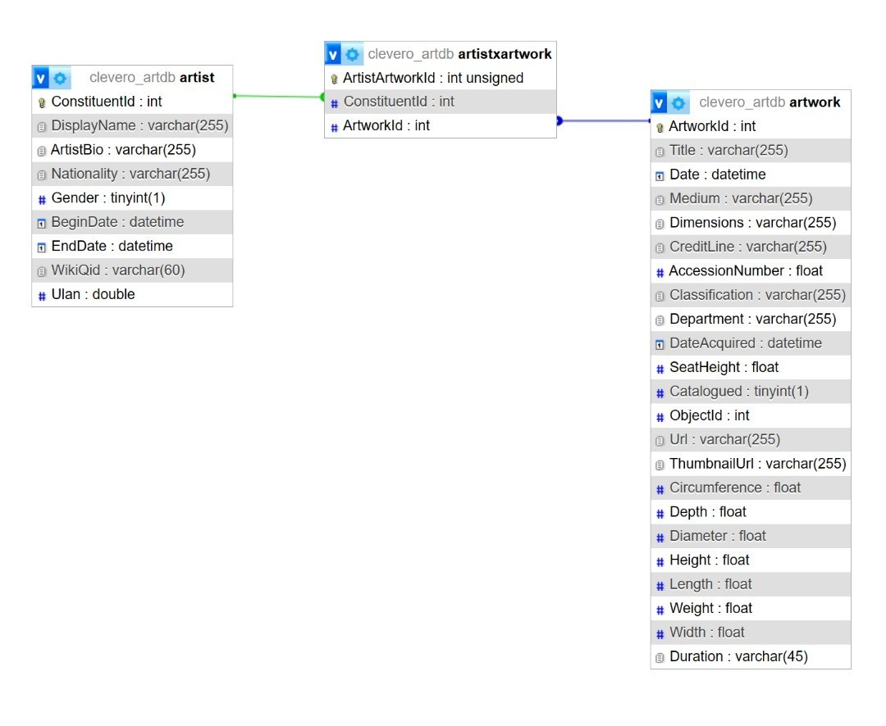

# CLEVERO ASSIGNMENT SUBMISSION

### Installation

1. Clone repository: ''
2. Navigate: `cd server`

- Install dependencies: `npm install`
- `npm start`

3. Navigate: `cd reactfrontend`

- Install dependencies and run

### Database

Hosted on `https://db4free.net/phpMyAdmin/`
username: `artistartwork`
password: `password123`
Database Name: `clevero_artdb`
Database Details: [Database Document](./Dataset/ERD_artistartwork.pdf)

#### ERD

